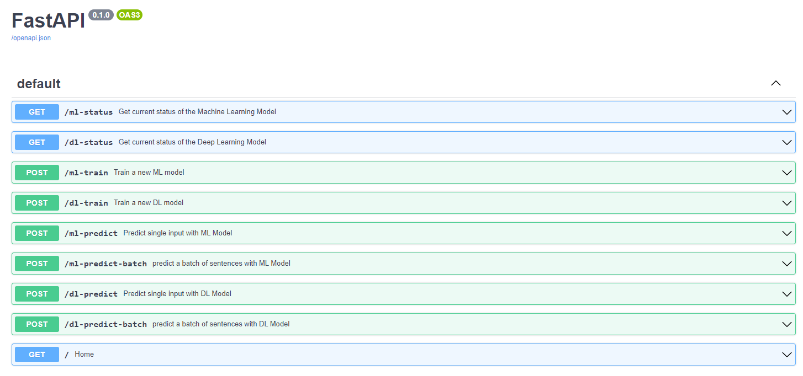

# Api! 🌍
To run the api simply clone the repository and download the weights files and then run the ```run.sh``` file. 

## Output 🎨
Here is an overview of the API.



## get- /ml-status
to get the Machine Learning Model current status.

## get- /dl-status
to get the Deep Learning Model current status.

## post- /ml-train
takes 2 lists of text data and labels to train a new Machine learning model.

## post- /dl-train
takes 2 lists of text data and labels to train a new Deep learning model.

## post- /ml-predict
takes one text sample to predict the Dialect from the text with the Machine learning model.

## post- /dl-predict
takes one text sample to predict the Dialect from the text with the Deep learning model.

## post- /ml-predict-batch
takes a list of text data to predict the Dialect from the text with the Machine learning model.

## post- /dl-predict-batch
takes a list of text data to predict the Dialect from the text with the Deep learning model.
